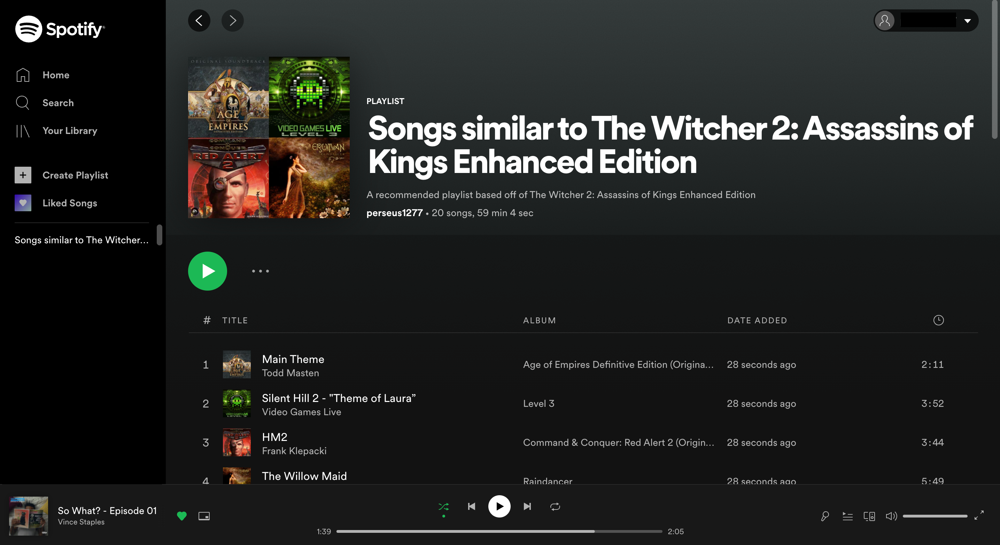

# SteamOST

This project allows a user to select a game from their steam library, and then redirects them to the spotify page of that games' soundtrack, as well as creating a 
playlist of music similar to the game selected.

Technology used: Python, Steam API, Spotify API, Youtube API

### Redirecting user to OST of the game 

### Creating a playlist of music similar to selected game OST

